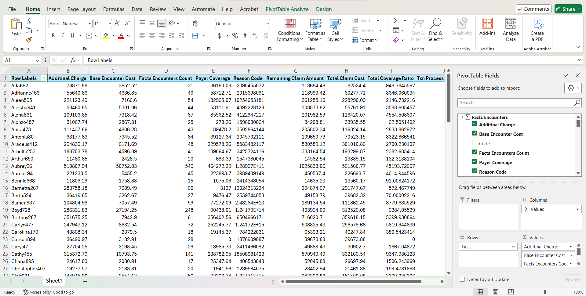

# 🏥 Healthcare Power BI and Excel Documentation

## 📚 Table of Contents

- [Overview](#overview)
- [Dataset](#dataset)
- [Tools Used](#tools-used)
- [Screenshots](#screenshots)
- [Author](#author)
- [Related Projects](#related-projects)
- [License](#license)

---

## Overview

This project includes **interactive reports and dashboards** developed using **Microsoft Power BI** and **Excel**, based on a star-schema healthcare data warehouse and SSAS cube.

---

## Tools Used

- **Microsoft Power BI** 
- **Microsoft Excel**

---

## Screenshots

### 📊 Power BI Reports

#### 📋 Report 1 – Matrix Visual

#### 🎯 Report 2 – Cascading Filters & Visuals

#### 📈 Report 3 – Drill-Down Report
  

#### 🔍 Report 4 – Drill-Through Report
  

### 📊 Excel Pivot Report

---

## Author

- **Student:** Peiris T.C.L 
- **Institution:** Sri Lanka Institute of Information Technology  
- **Course:** DWBI

---

## Related Projects

- [Healthcare OLTP to Data Warehouse](https://github.com/ChaLinP/Healthcare-OLTP-to-Data-Warehouse-for-Analytics)
- [Healthcare SSAS Cube](https://github.com/ChaLinP/Healthcare-SSAS-Cube)
- [Healthcare Power BI and Excel Documentation](https://github.com/ChaLinP/Healthcare-Power-BI-and-Excel-Documentation)

---

## License
This project is licensed under the MIT License. See the [LICENSE](./LICENSE) file for details.
